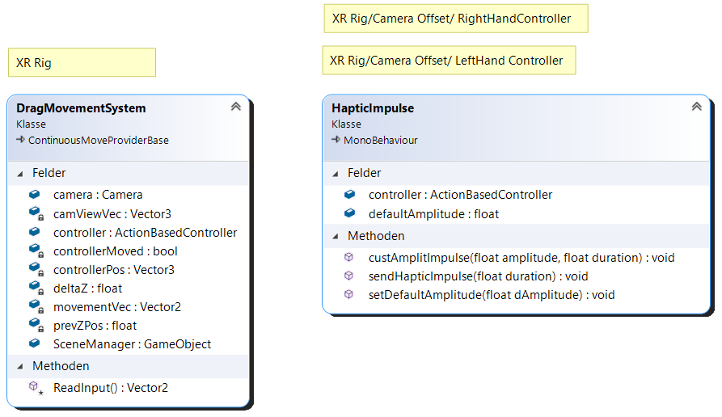
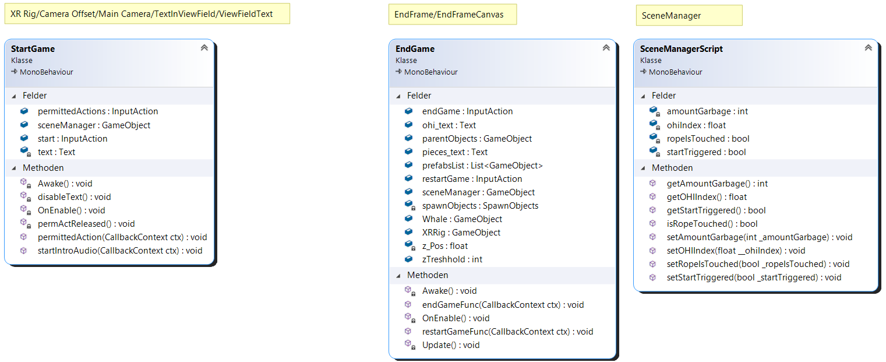
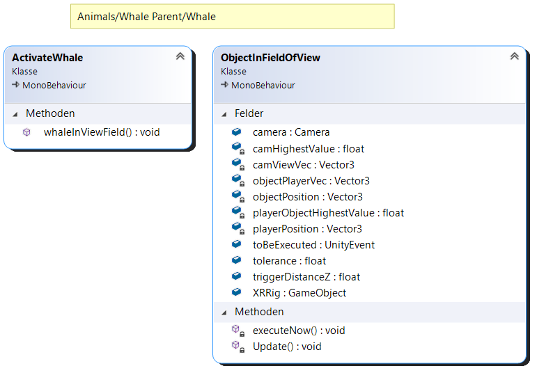

<h1>Technical Documentation: Underwater Protection</h1>

<h3>In this technical Documentation you'll find everything you need to start using and improving our project.</h3>
This markdown file is best viewed in visual studio code.

#

## Requirements
Unity Version: 2020.3.16f1

#
## Hierachy
Our Hierarchy is structured as follows:


The empty Gameobjects with the underscores are supposed to be Dividers. It gives a nice Overview and you know where to find everything. 
The __MANAGERS__ include our SceneManager that handles global variables. Under __CAMERA__ you'll see the XRRig and under the MainCamera you can see a Canvas that shows a text when the game begins. Under our RightHand Controller are the Vacuum Cleaner and Watch Objects.
You'll find all Objects that can be interacted with under __OBJECTS__, all other Objects that build the World like Frames, Bushes, Rocks, Terrain, Plane Background Audios are under __WORLD__.
You'll find empty Gameobjects with Scripts attached to it under __SCRIPTS__ and __ANIMATIONS__, where you can find the Path the Whale follows. We used a [Path Creator Tool](#bezier-path-creator) for that.

#
## Folders
The Unity-Project is organised into these folders:
* `Animations` 
* `Audio` -> All Audio Files
* `Documentation` -> Technical and Design Documentation
* [`External Assets`](#assets)
* `Materials` 
* `Models` 
    * `Prefab`
* `Scenes` -> The main Scene 
* [`Scripts`](#scripts)
    * `Audio` -> All Scripts working with some kind of Audio
    * `Interaction` -> Interactions: p.e. checking if Player looks a particular way or destroying an object, haptic feedback
    * `Movement` -> moving along the rope
    * `Objects` -> spawning new Objects like Rocks, Garbage and Plants
    * `Other` -> Scene Manager for global Variables
    * `World` -> animal-related Scripts
* `XR` -> XR Interaction Toolkit

#
## Assets

We ordered our list of assets into two categories: Imported ones and those, we created ourselves.

.

### Imported

Note: The paths listed below belong to the assets actally used in the game. Assets that are in the project because they are part of a specific package but are not used in the game are not included.

#### 3D Models
* Whale
    * Assets/ExternalAssets/Humpback whale/humpback_whale_model_baked_animation.FBX
    * [LINK ZUM ASSET](https://assetstore.unity.com/packages/3d/characters/animals/fish/humpback-whale-3547)
* Coke Can
    * Assets/ExternalAssets/External Garbages/Cola Can/Cola Can.prefab
    * [LINK ZUM ASSET](https://assetstore.unity.com/packages/3d/cola-can-96659)
* Sardinia
    * Assets/ExternalAssets/Sardine/Prefabs/SardineSkinWithDemoScript.prefab 
    * [LINK ZUM ASSET](https://assetstore.unity.com/packages/3d/characters/animals/fish/sardine-37963)
* Hands
    * Assets/Models/Prefab/Hand 1.prefab
    * [LINK ZUM ASSET](https://github.com/Novaborn-dev/VR-Hands-with-Unity-XR)
* Rocks
    * Choice of 
        * Assets/ExternalAssets/PBR_Rock_Cliffs_Pack/Prefabs/Static_Stone_Prefabs
        * Assets/ExternalAssets/PBR_Rock_Cliffs_Pack/Prefabs/Standart_Stone_Prefabs  
    * [LINK ZUM ASSET](https://assetstore.unity.com/packages/3d/props/exterior/pbr-rock-cliffs-pack-105772)
* Bottle: 
    * Assets/ExternalAssets/External Garbages/Bottle.prefab
    * [LINK ZUM ASSET](https://blendswap.com/blend/2410)
* Plastic bag:
    * Assets/ExternalAssets/External Garbages/Package/hanging_package.fbx
    * [LINK ZUM ASSET](https://www.turbosquid.com/3d-models/3d-model-pbr-glossiness-1703956#)
* Bushes:
    * Assets/ExternalAssets/YughuesFreeBushes2018/Prefabs/P_Bush01.prefab
    * Assets/ExternalAssets/YughuesFreeBushes2018/Prefabs/P_Bush02.prefab
    * Assets/ExternalAssets/YughuesFreeBushes2018/Prefabs/P_Bush03.prefab
    * Assets/ExternalAssets/YughuesFreeBushes2018/Prefabs/P_Bush04.prefab
    * Assets/ExternalAssets/YughuesFreeBushes2018/Prefabs/P_Bush05.prefab
    * [LINK ZUM ASSET](https://assetstore.unity.com/packages/3d/vegetation/plants/yughues-free-bushes-13168)

.
#### Animations
All whale and fish animations are from the imported packages. 
We made some animations ourselves but they did not made it into the final product

.
#### Textures
* [Wood-Textures](https://assetstore.unity.com/packages/2d/textures-materials/wood/hand-painted-seamless-wood-texture-vol-6-162145)

.
#### Audio
* We created a new Underwater Effect in Audition from these two Audiofiles
    * [Underwater Ambience](https://freesound.org/people/YoloSwaggings/sounds/406623/)
    * [Underwater Bubbles](https://freesound.org/people/Robinhood76/sounds/96742/)
* [Humpback Whale Song from Monterey Bay](https://www.youtube.com/watch?v=5tRMqbPH_pk)

.
#### Scripts
* #### Bezier Path Creator
    for creating Curves our Whale and Fish can follow
    * Assets/ExternalAssets/PathCreator
    * <a href="https://assetstore.unity.com/packages/tools/utilities/b-zier-path-creator-136082" name="bezier">LINK ZUM ASSET</a> 
        ``` 
        using PathCreation.Examples
.

.
### Created by the Developers
#### 3D-Models
* Vacuum Cleaner Attachment at the Front (created with Fusion360)

.

#### Scripts
Every script, if not mentioned otherwise, is created by the Dev's. 
They all start with a clear description of what it's for. It looks like this:

```markdown title = "Code Template for every Script"
/***************************************************************************************************************************
This script provides a MovementSystem for dragging the player along the rope through the world. It gives the possibility to move along the rope in both directions. Therefore the player has to grap the rope with his left hand by pushing the grip button. Then he can drag himself just like he would do in the real world along the rope.
***************************************************************************************************************************/
```
Two mentions of scripts we are very proud of because it shows an innovative approach and functions as planned:
* [Drag Movement System](#dragmovementsystem)
    * Assets/Scripts/Movement_Scripts/dragMovementSystem.cs
    * Inspired by the Continuous Move Provider from [XR Interaction Toolkit](https://docs.unity3d.com/Packages/com.unity.xr.interaction.toolkit@0.9/manual/index.html)

* [Object in Field of Fiew](#objectinfieldofview)
    * Assets/Scripts/Interaction/ObjectInFieldOfView.cs
    * This gets triggered if the Player looks at the object from a defined distance
#
## Software-Engineering

### Classes
Here we are explaining what is happening inside our Classes. If the Classname or the functions are self-explaining what is happening we will not describe it. The yellow boxes above the Scripts are showing the GameObjects where the Script can be found. You can find our full Class Diagram in the Folder _Assets/Documentation/Doc_Pictures_.

In the following Picture are our Scripts related to Audio. The AudioClass manages a AudioSource, when it is triggered and played. The AudioManagerScript on the other Hand gets all Audio Clips and is responsible for saving a clip and playing it when the player wants to.
The whaleSingingScript is checking when the player is at a predefined Z-Position and plays the Sounds of a whale singing. It also stops it.


#### DragMovementSystem 
is allowing the player to grab the rope and pull forward. The HapticImpulse Script is triggered when the player grabs a garbage object and the controller sends a haptic Feedback.



The following Scripts are for Interaction with Objects.
SpawnObjects is spawning a defined amount of an inserted prefab at a coordination that needs to be specified. The watchScript manages all displays on the watch. The ChangeWorldScript is similar to the SpawnObjects Script and spawns a defined amount of Fishgroups inside the Game. It is triggered when the player collects more garbage so more and more fishgroups will appear. 


The StartGame Script checks if the Player has pressed the Trigger-Button to start the Game. And it enables the first Audio to play. The [EndGame Script](#ending-the-game) is checking how much garbage is collected and puts these values on a frame at the end of the rope. It is also enabling the player to restart or end the game.
The SceneManagerScript is managing all global variables.


The following Scripts are used for the whale. 
#### ObjectInFieldOfView 
is checking if the Player is watching at the while from a defined distance and only then allows the whale to start swimming. 



.

### State Diagram for Audio
In the following diagram you can see a state diagram of sorts. We did not really use a state system for the audio, instead just triggered the audios depending on how far the Player has come along the rope. Nonetheless this will help to understand when which audio is played. 


#
## Learnings & Other Things
### Git
We used git for versioncontrol and simultaneous working and it was no fun at all. Unity and Git do not like each other, so we would not recommend it. The time we spend merging and fixing problems, would've been spend better at improving our game. At least we are quite good at git now. Try using Unity Teams if you work with others!

### Physics
You might wonder why our rocks fall out of the sky and not just spawn at a predefined position. This has two reasons. Since we have a terrain with areas at different heights we would always find rocks spawning under the terrain and since they have gravity activated, they would fall forever. This would mean a massive toll on Game-Rendering.
We could just turn of the Gravity and let the rocks spawn at different and random heights. But then they could spawn right in the center of the terrain and this would look quite weird. 
Using gravity also brings some randomness and reality to how the rocks are falling down (or even rolling down the terrain) and on top of each other.

### Ending the Game
We wanted to give the player the option to end the game when he/she is at the end of the rope.
But there is a problem. Unity is ending the game inside the editor in a different manner compared to when the game is built into an executable file.
In Unity-Editor you would end the game with this line:
```
UnityEditor.EditorApplication.isPlaying = false;
```
And for the executable file you would use this:
```
Application.Quit();
```
Maybe there is a way to check if we are in Game-Mode in the Unity-Editor or playing the game from the executable file. Unity would not build our App when we left both lines inside the script.
Therefore we just removed the upper line for the executable file and swapped it afterwards so the user/developer are able to end the game in the Editor.

## Contact
If you have any further questions, feel free to contact us:
* [Marvin Ottersberg](mailto:marvin.ottersberg@student.fh-kiel.de)
* [Micha Wewers](mailto:micha.t.wewers@student.fh-kiel.de)